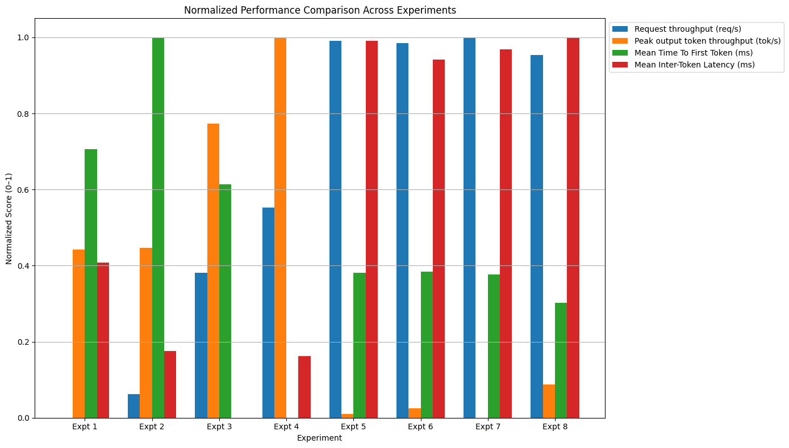
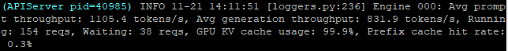
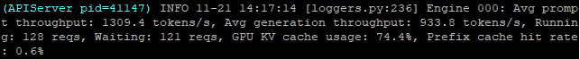
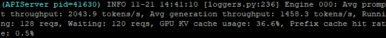
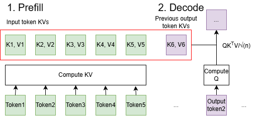
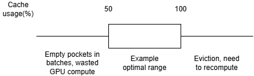
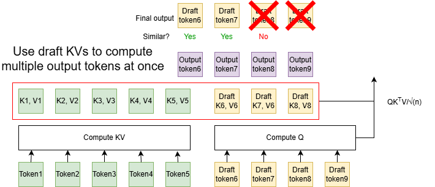
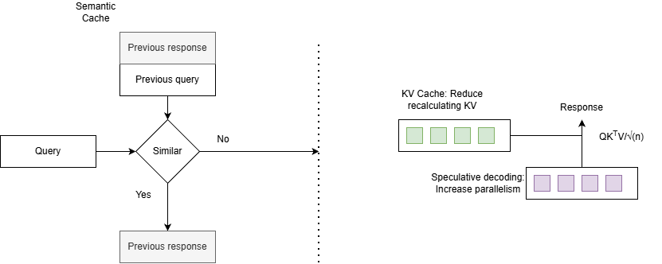

# VLLM demo

In this repository, we explore how to optimize a LLM server to maximize token throughput, using vLLM.

To setup the environment, you can run:

```
pip install uv
export PATH="$HOME/.local/bin:$PATH"
uv init
uv sync
source .venv/bin/activate
```

## Setup

Choice of model: [microsoft/Phi-4-mini-instruct](https://huggingface.co/microsoft/Phi-4-mini-instruct)

Hardware:
- 4 x vCPU cores
- 16GB RAM
- 100GB disk space
- 1 × NVIDIA L4 GPU (24 GB VRAM)
- Ubuntu 24.04 LTS

Simulated traffic:
- 250 concurrent users
- 50 requests per second
- Input token length around 256 to 512
- Requests for automated answers

## Results summary

Selected key metrics are shown for quick trend identification



Trends:
- Request throughput increases with quantizing KV cache, use of speculative decoding, and [optimizing KV cache usage](#optimizing-kv-cache-usage).
- Target model produces significantly fewer accepted tokens with speculative decoding.
- Generally Inter Token Latency (ITL) decreases with [better KV cache usage](#optimizing-kv-cache-usage). Speculative decoding causes ITL to increase as accepted target tokens will come in more spontaneously.

Experiments with best performance metrics:
- Experiment 3 has the shortest Inter Token Latency (ITL), as it has the smallest KV cache quantization and smallest KV cache size, which both lead to faster attention steps.
- Experiment 4 have a very short mean Time To First Token (TTFT). A possible explanation is a perfect balance of params that minimize idle time and kernel launch overhead.
- Experiment 7 has the best request throughput, showing that it has the best compute efficiency.

The following is a more detailed breakdown of parameters and metrics for each experiment:

| Experiment                           | Expt 1   | Expt 2   | Expt 3   | Expt 4      | Expt 5         | Expt 6         | Expt 7     | Expt 8        |
|--------------------------------------|----------|----------|----------|-------------|----------------|----------------|------------|---------------|
| Max num seqs                         | (256)    | **128**  | 128      | **256**     | 256            | 256            | **512**    | **256**       |
| KV Cache dtype                       | (fp16)   | (fp16)   | **fp8**  | fp8         | fp8            | fp8            | fp8        | fp8           |
| Speculative decoding                 | None     | None     | None     | None        | **suffix(16)** | **suffix(12)** | suffix(12) | **suffix(8)** |
|--------------------------------------|----------|----------|----------|-------------|----------------|----------------|------------|---------------|
| Benchmark duration (s)               | 214.32   | 193.27   | 127.85   | 108.30      | 77.71          | 78.02          | 77.22      | 79.61         |
| Request throughput (req/s)           | 2.33     | 2.59     | 3.91     | 4.62        | 6.43           | 6.41           | 6.47       | 6.28          |
| Output token throughput (tok/s)      | 857.63   | 951.06   | 1437.69  | 1697.24     | 2365.34        | 2355.90        | 2380.28    | 2308.78       |
| Peak output token throughput (tok/s) | 1498.00  | 1509.00  | 2242.00  | 2750.00     | 529.00         | 560.00         | 505.00     | 700.00        |
| Peak concurrent requests             | 257.00   | 257.00   | 259.00   | 261.00      | 266.00         | 266.00         | 267.00     | 266.00        |
| Total Token throughput (tok/s)       | 1724.94  | 1912.85  | 2891.61  | 3413.64     | 4757.38        | 4738.40        | 4787.43    | 4643.63       |
| Mean Time To First Token (ms)        | 24821.90 | 34028.43 | 21939.51 | 2724.31     | 14662.15       | 14731.48       | 14537.99   | 12164.28      |
| Mean Time Per Output Token (ms)      | 180.52   | 121.24   | 77.63    | 118.33      | 38.98          | 38.49          | 38.42      | 50.40         |
| Mean Inter-Token Latency (ms)        | 178.79   | 121.09   | 77.54    | 117.78      | 323.24         | 311.21         | 317.72     | 325.66        |

### Optimizing KV cache usage

For the following experiments, `max_num_seqs` has been adjusted to improve KV cache usage, leading to an increase in request throughput.

Experiment 1: KV cache over-utilization

Over-utilization due to too batch size being too large.

Experiment 3: KV cache under-utilization

Under-utilization due to reduced cache memory requirement from quantization.

Experiment 6: KV cache under-utilization

Under-utilization due to introduction of speculative decoding.

## How to tune your LLM sever

### Understanding server performance metrics

Here's a summary diagram to understand the different latencies associated with a request to your LLM (taken from [NVIDIA](https://developer.nvidia.com/blog/llm-benchmarking-fundamental-concepts/)):

[LLM inference performance metrics](img/llm-inference-performance-metrics.png)

- Request/token throughput: Measures how much work your server can handle.

$$\frac{Total\ requests/tokens}{Total\ duration (s)}$$

- Time To First Token (TTFT): Time from sending a request to receiving the first token

$$t_{firsttoken} - t_{request}$$

- Time Per Output Token (TPOT): Unlike ITL, includes overhead

$$\frac{TTFT + Generation\ time}{Num\ Tokens}$$

- Inter-Token Latency (ITL): Latency between each generated token, excluding the first

$$\frac{Generation\ time}{Num\ Tokens - 1}$$

### Understanding how LLM inference works



For decoder-only LLMs they need to compute QKV weights to calculate self-attention.

Q is computed for the current token, hence it is not cached.
K and V are computed for all previous tokens, so it makes sense to cache these values.

LLMs perform 2 forward pass:
1. Prefill: Calculate KV values
2. Decode: Generate autoregressively using KV values (Decode)

We can cache and reuse these KV values, but that will mean:
- Prefill is compute intensive (calculates many KV values)
- Decode is memory intensive (requires the KV values in cache)

Hence the key here is to ensure that our compute is not wasted, while there is sufficient available memory for KV cache.

### Choosing model capacity

Follow the suggested user input size. Using an output token = input token limit, we set max_new_tokens = 512 and max-model-len = 1024

### Tuning KV Cache



Cache eviction strategy
When the KV cache memory limit is reached, one common strategy is to evict older KV entries.

Chunk prefilling overhead

### Speculative decoding



Speculative decoding uses a lighter model to draft the next few output tokens, and verifies these tokens in a single forward pass. Compared to decoding 1 token at a time, this method allows decoding multiple tokens with high probability, leading to a performance speedup.

This is how speculative decoding generates the next tokens:
1. Draft phase: The next few tokens are generated using the **draft model**.
2. Verify phase: Draft tokens are compared with target tokens, and kept if similar enough.
    - The next few tokens are generated using the **target model** in **1 pass**.
    - Each draft token is compared with the target token.
    - All consecutive similar draft tokens are kept.

For this experiment, suffix decoding was chosen. If you have a suitable speculative model, I encourage you to try some more advanced decoding techniques with it!

### Other tuning considerations

#### When to use quantization

Quantization reduces the precision of model weights and activations. This provides two major benefits:
- Lower memory bandwidth usage: Smaller weights take less memory.
- Higher throughput: Lower precision formats can run more operations per clock on GPUs.

Quantization can also indirectly enable longer context windows or larger batch sizes because the KV cache and model weights consume less memory.

However, there are important caveats:
- If the GPU does not natively support low-precision formats, additional overhead is incurred to dequantize weights and activations before computation.
- Quantization introduces an accuracy trade-off, with more aggressive formats (INT8/INT4) typically degrading output quality.

For our setup, the GPU does not support running quantized models efficiently, as noted in the vLLM documentation:
- https://docs.vllm.ai/en/latest/features/quantization/fp8/
- https://docs.vllm.ai/en/latest/features/quantization/int8/

#### Greedy decoding

Greedy decoding selects the single most likely next token at every generation step. This has two main consequences:

1. Deterministic output: The model always produces the same sequence for the same input.
2. Reduced computation: No need for sampling methods like temperature, top-k, or nucleus sampling, and no extra processing to evaluate multiple candidate tokens.

For our use case, our LLM only needs to give automated answers. In this case, we don't need the LLM to give varying outputs, so we can use greedy decoding.

#### Input and output clipping

As a follow-up of our model's capacity, we will enforce the input and output size using our proxy server.

### Bonus: Semantic cache



So far we have discussed 2 ways of reducing the number of computations of our LLM server: KV Caching and Speculative Decoding. What if we can reuse the computed result of our previous queries?

We can indeed do that, using a semantic cache. The key is to only reuse results if the 2 queries are similar enough. We can calculate similarity score by first converting the queries into embeddings, then calculating the cosine similarity of the 2 embeddings.

Contextual caches can greatly improve your performance if many queries are similar. Thanks to this cache our server is able to achieve blazingly fast speeds! Also, if you happen to have spare resources lying around (spare CPU and RAM for my case), don't be afraid to use it!

## Experiment details

The command used for our stress test is as follows:
```
vllm bench serve \
    --model microsoft/Phi-4-mini-instruct \
    --port 8000 \
    --max-concurrency 250 \
    --request-rate 50 \
    --random-input-len 365 \
    --random-output-len 365 \
    --random-range-ratio 0.4 \
    --num-prompts 500
```

### Expt 1: Baseline experiment
```
vllm serve microsoft/Phi-4-mini-instruct --host 0.0.0.0 --port 8000 \
--gpu-memory-utilization 0.9 \
--override-generation-config '{"temperature": 0, "top_p": 1, "top_k": 1, "max_new_tokens": 512}' \
--max-model-len 1024

============ Serving Benchmark Result ============
Successful requests:                     500
Failed requests:                         0
Maximum request concurrency:             250
Request rate configured (RPS):           50.00
Benchmark duration (s):                  214.32
Total input tokens:                      185881
Total generated tokens:                  183806
Request throughput (req/s):              2.33
Output token throughput (tok/s):         857.63
Peak output token throughput (tok/s):    1498.00
Peak concurrent requests:                257.00
Total Token throughput (tok/s):          1724.94
---------------Time to First Token----------------
Mean TTFT (ms):                          24821.90
Median TTFT (ms):                        25950.57
P99 TTFT (ms):                           72613.94
-----Time per Output Token (excl. 1st token)------
Mean TPOT (ms):                          180.52
Median TPOT (ms):                        177.13
P99 TPOT (ms):                           361.29
---------------Inter-token Latency----------------
Mean ITL (ms):                           178.79
Median ITL (ms):                         148.09
P99 ITL (ms):                            389.56
==================================================
```

### Expt 2: Reducing max-num-seqs
```
vllm serve microsoft/Phi-4-mini-instruct --host 0.0.0.0 --port 8000 \
--gpu-memory-utilization 0.9 \
--override-generation-config '{"temperature": 0, "top_p": 1, "top_k": 1, "max_new_tokens": 512}' \
--max-model-len 1024 \
--max-num-seqs 128

============ Serving Benchmark Result ============
Successful requests:                     500
Failed requests:                         0
Maximum request concurrency:             250
Request rate configured (RPS):           50.00
Benchmark duration (s):                  193.27
Total input tokens:                      185881
Total generated tokens:                  183806
Request throughput (req/s):              2.59
Output token throughput (tok/s):         951.06
Peak output token throughput (tok/s):    1509.00
Peak concurrent requests:                257.00
Total Token throughput (tok/s):          1912.85
---------------Time to First Token----------------
Mean TTFT (ms):                          34028.43
Median TTFT (ms):                        44063.73
P99 TTFT (ms):                           60126.40
-----Time per Output Token (excl. 1st token)------
Mean TPOT (ms):                          121.24
Median TPOT (ms):                        127.01
P99 TPOT (ms):                           134.04
---------------Inter-token Latency----------------
Mean ITL (ms):                           121.09
Median ITL (ms):                         112.08
P99 ITL (ms):                            254.91
==================================================
```


### Expt 3: Reduce KV cache precision
```
vllm serve microsoft/Phi-4-mini-instruct --host 0.0.0.0 --port 8000 \
--gpu-memory-utilization 0.9 \
--override-generation-config '{"temperature": 0, "top_p": 1, "top_k": 1, "max_new_tokens": 512}' \
--max-model-len 1024 \
--max-num-seqs 128 \
--kv-cache-dtype fp8 \
--calculate-kv-scales

============ Serving Benchmark Result ============
Successful requests:                     500
Failed requests:                         0
Maximum request concurrency:             250
Request rate configured (RPS):           50.00
Benchmark duration (s):                  127.85
Total input tokens:                      185881
Total generated tokens:                  183806
Request throughput (req/s):              3.91
Output token throughput (tok/s):         1437.69
Peak output token throughput (tok/s):    2242.00
Peak concurrent requests:                259.00
Total Token throughput (tok/s):          2891.61
---------------Time to First Token----------------
Mean TTFT (ms):                          21939.51
Median TTFT (ms):                        28017.94
P99 TTFT (ms):                           38623.76
-----Time per Output Token (excl. 1st token)------
Mean TPOT (ms):                          77.63
Median TPOT (ms):                        80.50
P99 TPOT (ms):                           86.50
---------------Inter-token Latency----------------
Mean ITL (ms):                           77.54
Median ITL (ms):                         65.23
P99 ITL (ms):                            209.19
==================================================
```

### Expt 4: Increase max-num-seqs to max KV Cache utilization
```
vllm serve microsoft/Phi-4-mini-instruct --host 0.0.0.0 --port 8000 \
--gpu-memory-utilization 0.9 \
--override-generation-config '{"temperature": 0, "top_p": 1, "top_k": 1, "max_new_tokens": 512}' \
--max-model-len 1024 \
--max-num-seqs 256 \
--kv-cache-dtype fp8 \
--calculate-kv-scales

============ Serving Benchmark Result ============
Successful requests:                     500
Failed requests:                         0
Maximum request concurrency:             250
Request rate configured (RPS):           50.00
Benchmark duration (s):                  108.30
Total input tokens:                      185881
Total generated tokens:                  183806
Request throughput (req/s):              4.62
Output token throughput (tok/s):         1697.24
Peak output token throughput (tok/s):    2750.00
Peak concurrent requests:                261.00
Total Token throughput (tok/s):          3413.64
---------------Time to First Token----------------
Mean TTFT (ms):                          2724.31
Median TTFT (ms):                        440.49
P99 TTFT (ms):                           10616.42
-----Time per Output Token (excl. 1st token)------
Mean TPOT (ms):                          118.33
Median TPOT (ms):                        122.20
P99 TPOT (ms):                           141.59
---------------Inter-token Latency----------------
Mean ITL (ms):                           117.78
Median ITL (ms):                         98.73
P99 ITL (ms):                            330.58
==================================================
```

### Expt 5: Speculative Decoding
```
vllm serve microsoft/Phi-4-mini-instruct --host 0.0.0.0 --port 8000 \
--gpu-memory-utilization 0.9 \
--override-generation-config '{"temperature": 0, "top_p": 1, "top_k": 1, "max_new_tokens": 512}' \
--max-model-len 1024 \
--max-num-seqs 256 \
--kv-cache-dtype fp8 \
--calculate-kv-scales \
--speculative_config '{"method": "suffix", "num_speculative_tokens": 16}'

============ Serving Benchmark Result ============
Successful requests:                     500
Failed requests:                         0
Maximum request concurrency:             250
Request rate configured (RPS):           50.00
Benchmark duration (s):                  77.71
Total input tokens:                      185881
Total generated tokens:                  183806
Request throughput (req/s):              6.43
Output token throughput (tok/s):         2365.34
Peak output token throughput (tok/s):    529.00
Peak concurrent requests:                266.00
Total Token throughput (tok/s):          4757.38
---------------Time to First Token----------------
Mean TTFT (ms):                          14662.15
Median TTFT (ms):                        18744.88
P99 TTFT (ms):                           23324.14
-----Time per Output Token (excl. 1st token)------
Mean TPOT (ms):                          38.98
Median TPOT (ms):                        33.03
P99 TPOT (ms):                           138.35
---------------Inter-token Latency----------------
Mean ITL (ms):                           323.24
Median ITL (ms):                         366.12
P99 ITL (ms):                            426.54
==================================================
```

### Expt 6: Removing ineffective speculated tokens
```
vllm serve microsoft/Phi-4-mini-instruct --host 0.0.0.0 --port 8000 \
--gpu-memory-utilization 0.9 \
--override-generation-config '{"temperature": 0, "top_p": 1, "top_k": 1, "max_new_tokens": 512}' \
--max-model-len 1024 \
--max-num-seqs 256 \
--kv-cache-dtype fp8 \
--calculate-kv-scales \
--speculative_config '{"method": "suffix", "num_speculative_tokens": 12}'

============ Serving Benchmark Result ============
Successful requests:                     500
Failed requests:                         0
Maximum request concurrency:             250
Request rate configured (RPS):           50.00
Benchmark duration (s):                  78.02
Total input tokens:                      185881
Total generated tokens:                  183806
Request throughput (req/s):              6.41
Output token throughput (tok/s):         2355.90
Peak output token throughput (tok/s):    560.00
Peak concurrent requests:                266.00
Total Token throughput (tok/s):          4738.40
---------------Time to First Token----------------
Mean TTFT (ms):                          14731.48
Median TTFT (ms):                        18716.76
P99 TTFT (ms):                           23370.19
-----Time per Output Token (excl. 1st token)------
Mean TPOT (ms):                          38.49
Median TPOT (ms):                        32.89
P99 TPOT (ms):                           139.40
---------------Inter-token Latency----------------
Mean ITL (ms):                           311.21
Median ITL (ms):                         364.70
P99 ITL (ms):                            427.26
==================================================
```

### Expt 7: Increase max-num-seqs to max KV Cache utilization (second time)
```
vllm serve microsoft/Phi-4-mini-instruct --host 0.0.0.0 --port 8000 \
--gpu-memory-utilization 0.9 \
--override-generation-config '{"temperature": 0, "top_p": 1, "top_k": 1, "max_new_tokens": 512}' \
--max-model-len 1024 \
--max-num-seqs 512 \
--kv-cache-dtype fp8 \
--calculate-kv-scales \
--speculative_config '{"method": "suffix", "num_speculative_tokens": 12}'

============ Serving Benchmark Result ============
Successful requests:                     500
Failed requests:                         0
Maximum request concurrency:             250
Request rate configured (RPS):           50.00
Benchmark duration (s):                  77.22
Total input tokens:                      185881
Total generated tokens:                  183806
Request throughput (req/s):              6.47
Output token throughput (tok/s):         2380.28
Peak output token throughput (tok/s):    505.00
Peak concurrent requests:                267.00
Total Token throughput (tok/s):          4787.43
---------------Time to First Token----------------
Mean TTFT (ms):                          14537.99
Median TTFT (ms):                        18649.05
P99 TTFT (ms):                           22857.57
-----Time per Output Token (excl. 1st token)------
Mean TPOT (ms):                          38.42
Median TPOT (ms):                        32.56
P99 TPOT (ms):                           144.84
---------------Inter-token Latency----------------
Mean ITL (ms):                           317.72
Median ITL (ms):                         366.01
P99 ITL (ms):                            394.36
==================================================
```

### Expt 8: Further reduce num_speculative_tokens
```
vllm serve microsoft/Phi-4-mini-instruct --host 0.0.0.0 --port 8000 \
--gpu-memory-utilization 0.9 \
--override-generation-config '{"temperature": 0, "top_p": 1, "top_k": 1, "max_new_tokens": 512}' \
--max-model-len 1024 \
--max-num-seqs 256 \
--kv-cache-dtype fp8 \
--calculate-kv-scales \
--speculative_config '{"method": "suffix", "num_speculative_tokens": 8}'

============ Serving Benchmark Result ============
Successful requests:                     500
Failed requests:                         0
Maximum request concurrency:             250
Request rate configured (RPS):           50.00
Benchmark duration (s):                  79.61
Total input tokens:                      185881
Total generated tokens:                  183806
Request throughput (req/s):              6.28
Output token throughput (tok/s):         2308.78
Peak output token throughput (tok/s):    700.00
Peak concurrent requests:                266.00
Total Token throughput (tok/s):          4643.63
---------------Time to First Token----------------
Mean TTFT (ms):                          12164.28
Median TTFT (ms):                        14486.44
P99 TTFT (ms):                           23394.65
-----Time per Output Token (excl. 1st token)------
Mean TPOT (ms):                          50.40
Median TPOT (ms):                        45.97
P99 TPOT (ms):                           158.98
---------------Inter-token Latency----------------
Mean ITL (ms):                           325.66
Median ITL (ms):                         375.96
P99 ITL (ms):                            433.85
==================================================
```

## Credits

A special thank you to Augustine, Deon and Syakyr from the MLOps team for sharing their knowledge and support, and AI Singapore for providing the VMs to run these experiments!